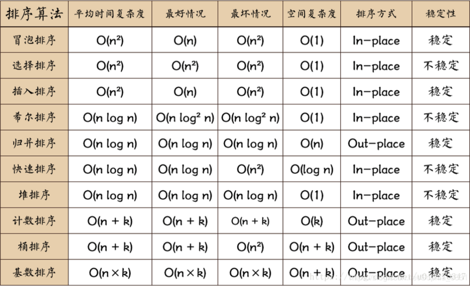
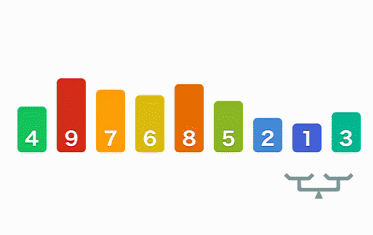
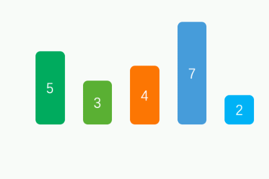
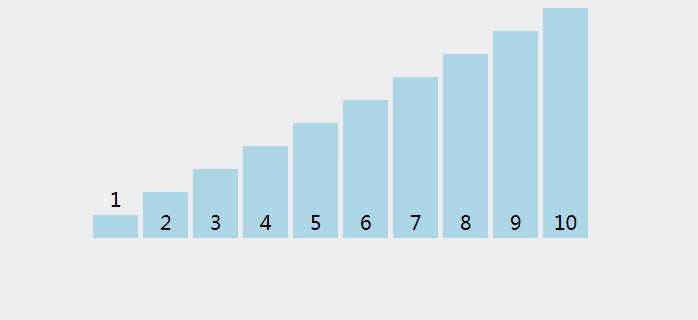
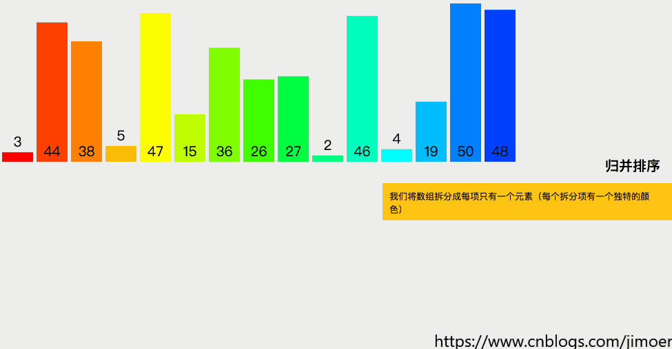
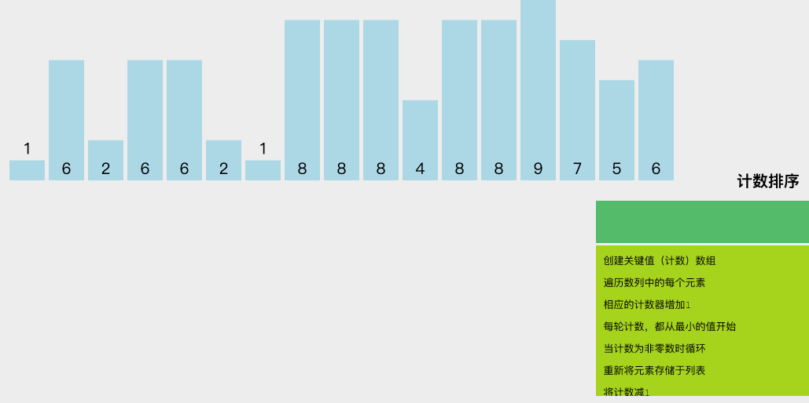
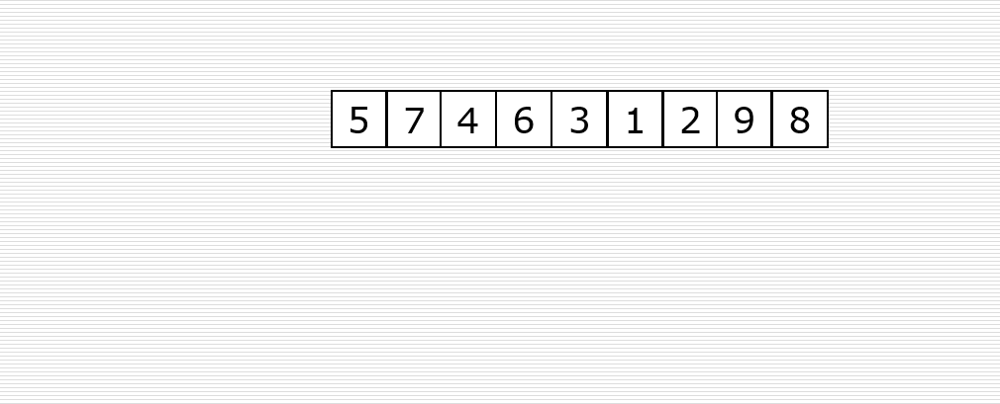
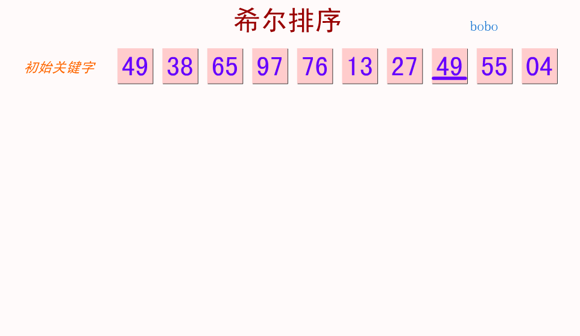

# 排序的分类
比较算法和非比较算法：
核心差异：比较算法基于元素间的直接比较进行排序，而非比较算法则是利用数据本身的特性来确定排序位置。
效率：非比较排序在特定条件下（如数据范围有限、分布均匀）可能比比较排序更高效，尤其是在处理大量数据时。
适用性：比较算法适用范围更广，几乎可以用于任何类型的数据；而非比较算法通常适用于整数、固定范围的数值或字符等特定类型数据。

稳定排序和非稳定排序:
稳定排序算法在处理具有相同键值的记录时，能够保持这些记录的相对顺序不变，而非稳定排序算法则不保证这一点。
主要是在处理复杂对象时需要考虑这一点

内部排序和外部排序:
根据数据存储位置的不同进行的分类，主要区别在于数据是否能够一次性全部加载到内存中进行处理。

# 复杂度

## 使用场景
选择排序算法时，应考虑：
- 数据规模
- 数据类型（是否为整数、浮点数、字符串等）
- 是否需要稳定排序
- 内存限制。例如，对于小数据集或几乎有序的数据，插入排序可能是最优选择；而对于大数据集，快速排序或归并排序更为合适。在内存限制严格的情况下，堆排序或希尔排序可能是更好的选择。

### 为什么要考虑类型
整数排序算法（如计数排序、基数排序）对整数特别有效，因为它们可以直接处理数字的每一位，而不需要进行复杂的比较操作。对于字符串，可能会选择比较排序算法。

# 简介
## 冒泡排序（Bubble Sort）

基本思想：重复遍历待排序的数列，一次比较两个元素，如果它们的顺序错误就把它们交换过来。遍历数列的工作是重复进行的，直到没有再需要交换的元素为止，这意味着数列已经排序完成。

## 选择排序（Selection Sort）

原理：首先在未排序序列中找到最小（或最大）元素，存放到排序序列的起始位置，然后再从剩余未排序元素中继续寻找最小（或最大）元素，然后放到已排序序列的末尾。以此类推，直到所有元素均排序完毕。

## 插入排序（Insertion Sort）

方法：将一个记录插入到已经排序好的有序表中，从而得到一个新的、记录数增加1的有序表。适用于小规模或部分已排序的数据集。

## 快速排序（Quick Sort）

策略：通过一个切分元素将数组分为两部分，左边都比它小，右边都比它大，然后递归地对这两部分继续进行快速排序。

## 归并排序（Merge Sort）

程序：采用分治法的思想，将数组分成两半分别排序，再将排序好的两半合并在一起。

## 堆排序（Heap Sort）

过程：利用堆这种数据结构所设计的一种排序算法，将待排序的序列构造成一个大顶堆，此时，整个序列的最大值就是堆顶的根节点。将其与末尾元素进行交换，此时末尾就为最大值。然后将剩余n-1个元素重新构造成一个堆，这样会得到n个元素的次小值。如此反复执行，便能得到一个有序序列了。

## 计数排序（Counting Sort）

特点：适合于一定范围内的整数排序，其核心在于使用一个额外的数组来计算每个值的出现次数。

## 桶排序（Bucket Sort）

原则：将数组分到有限数量的桶里，每个桶再分别排序（有可能再使用别的排序算法或是以递归方式继续使用桶排序进行排序）。适用于均匀分布的数据。

## 基数排序（Radix Sort）

方法：按照数值的每一位进行排序，先从最低位开始，然后逐步到最高位。适合整数排序，尤其是位数不多的情况。

## 希尔排序（Shell Sort）
技术：它是插入排序的一种更高效的版本，通过比较相距一定间隔的元素来工作，随着算法进行，逐渐减小间隔，直到间隔为1，此时算法退化为普通的插入排序，但此时的数组已经是基本有序的，插入排序会更高效。

